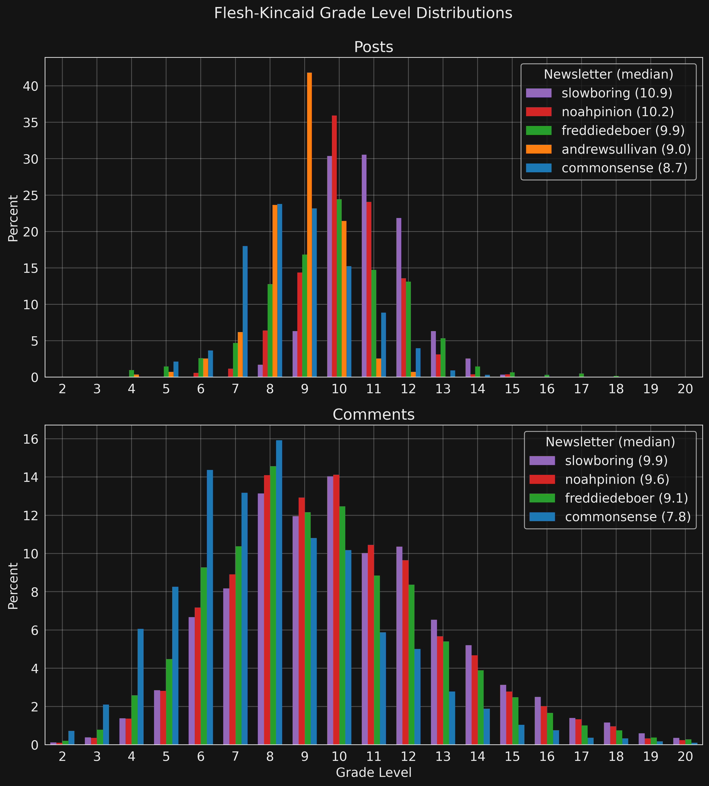

# Newsletter Stats

A work-in-progress analysis of some of the newsletters that I subscribe to.

You can find the most recent results in this [report](https://matthagy.github.io/newsletter_stats/report)
as well as an explanation of methods and data.

Results include the [Flesh-Kincaid test](https://en.wikipedia.org/wiki/Flesch%E2%80%93Kincaid_readability_tests#Flesch%E2%80%93Kincaid_grade_level)
US grade levels of posts and comments.

I've also looked into the distribution of comments per a post.

Posts and comments are fetched using [substack_client](https://github.com/matthagy/substack_client) as described in,
[Developing a Substack client to fetch posts and comments](https://matthagy.substack.com/p/developing-a-custom-substack-front).
The Flesh-Kincaid grade-level test is calculated using the [textstat](https://github.com/textstat/textstat) library.
See Jupyter notebook [analysis.ipynb](./analysis.ipynb) for implementation.
