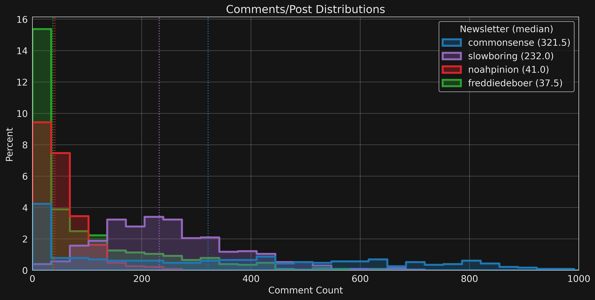

Method details in [appendix](#methods).

## Flesh-Kincaid grade-level test

We can use the
[Flesh-Kincaid test](https://en.wikipedia.org/wiki/Flesch%E2%80%93Kincaid_readability_tests#Flesch%E2%80%93Kincaid_grade_level)
to quantify the US grade level of posts and comments from these newsletters.

It is interesting to see that posts and comments for one newsletter have comparable grade levels.

The distributional stats for the posts are as follows.

| Newsletter     | Posts | Mean | Std | Min | 10% |  25% |  50% |  75% |  90% |  Max |
|:---------------|------:|-----:|----:|----:|----:|-----:|-----:|-----:|-----:|-----:|
| slowboring     |   579 |   11 | 1.2 | 7.6 | 9.6 | 10.2 | 10.8 | 11.7 | 12.4 | 15.3 |
| noahpinion     |   507 | 10.3 | 1.3 | 5.4 | 8.7 |  9.5 | 10.3 | 11.1 |   12 |   15 |
| freddiedeboer  |   613 |  9.9 |   2 | 3.8 | 7.6 |  8.7 |  9.9 | 11.2 | 12.3 | 17.8 |
| andrewsullivan |   275 |  8.8 |   1 | 4.5 | 7.6 |  8.4 |    9 |  9.4 |   10 | 11.7 |
| commonsense    |   328 |  8.7 | 1.6 | 5.1 | 6.8 |  7.5 |  8.7 |  9.8 | 10.8 | 13.5 |

And for comments

| Newsletter    | Comments | Mean | Std | Min | 10% | 25% | 50% |  75% |  90% | Max |
|:--------------|:---------|-----:|----:|----:|----:|----:|----:|-----:|-----:|----:|
| slowboring    | 148,062  | 10.1 | 3.1 | 1.2 | 6.4 | 7.9 | 9.8 | 12.1 | 14.2 |  20 |
| noahpinion    | 27,999   |  9.9 |   3 | 0.2 | 6.3 | 7.8 | 9.6 | 11.7 |   14 |  20 |
| freddiedeboer | 65,091   |  9.4 | 3.1 | 0.9 | 5.7 | 7.2 | 9.1 | 11.3 | 13.7 |  20 |
| commonsense   | 155,128  |  8.2 |   3 | 0.9 | 4.7 | 6.1 | 7.8 |  9.9 |   12 |  20 |

You can find
[examples](#example-comment-fk-scores)
of my comments and their FK scores in the appendix to calibrate your perception of these grade levels.

Note that comments with a FK test value greater than 20 are excluded from this analysis
as they generally correspond to improperly formatted text.
E.g., a bulleted list where each entry is not terminated with a period and thereby
the entire list is treated as single sentence.

## Comments per a post

We can also analyze the volume of comments on posts in each newsletter.
The following figure shows the distribution of comments-per-a-post for each newsletter.

Note that the x-axis is cutoff at 1000 comments/post because there are a few outlier posts
with an exceptionally large number of comments is indicated in the following table of
distribution stats.

| Newsletter    | Posts |  Mean |   Std | Min |  10% |   25% |   50% |   75% |   90% |  Max |
|:--------------|------:|------:|------:|----:|-----:|------:|------:|------:|------:|-----:|
| commonsense   |   436 | 355.8 | 312.1 |   0 |    0 |  56.5 | 321.5 | 584.8 |   798 | 1641 |
| slowboring    |   595 | 248.8 | 123.3 |   3 |  107 | 160.5 |   232 | 316.5 | 414.8 | 1034 |
| noahpinion    |   519 |  53.9 |  42.4 |   0 | 15.8 |  25.5 |    41 |  71.5 |   106 |  268 |
| freddiedeboer |   717 |  90.8 | 123.4 |   0 |    0 |     0 |    37 |   129 | 273.8 |  663 |

## Comment volume over time

Are subscribers commenting more or less over time?
To answer that question, the following figure plots the number of comments for each post by date.

Points correspond to individual posts and lines show the monthly average of comments/post.
In computing that average, posts with zero comments are excluded because
some authors disable comments for some of their posts.

## Appendix

### Methods

Posts and comments are fetched using [substack_client](https://github.com/matthagy/substack_client) as described in,
[Developing a Substack client to fetch posts and comments](https://matthagy.substack.com/p/developing-a-custom-substack-front).
The Flesh-Kincaid grade-level test is calculated using the [textstat](https://github.com/textstat/textstat) library.
You can view the analysis in the Jupyter notebook 
[analysis.ipynb](https://github.com/matthagy/newsletter_stats/blob/master/analysis.ipynb).

### Data

A simple Python script extracts relevant public metadata about posts and comments.
That is then augmented with the text-aggregation metrics of FK score and word count.
Data files on [github](TODO).

#### posts.csv

Each record corresponds to one post and the columns are as follows.

* `site` - Name of the newsletter
* `date` - Date posted
* `word_count` - Length of the post in words
* `grade_level` - Flesh-Kincaid grade level
* `comment_count` - Number of comments on post

#### comments.csv

A random sample of 10,000 comments for each newsletter.
Each record corresponds to one comment and the columns are as follows.

* `site` - Name of the newsletter
* `word_count` - Length of the article in words
* `grade_level` - Flesh-Kincaid grade level

### Example comment FK scores

Here are a few examples of my comments and their Flesh-Kincaid test values.
You can find all my comments and their FK grade levels in a searchable interface at
[matthagy.github.io/substack_comments](https://matthagy.github.io/substack_comments/).

KF = 19.7
> I find this relevant context for understanding why, as the article says, “it would be inappropriate for the Fed to
> declare victory on inflation”, and why the Fed is not indicating that, “ it is time to start taking a more measured
> approach and see how the data evolves.” It is important to know that even the inflation doves—including doves that set
> monetary policy—believe we need a softening in the labor market to get inflation under control and thereby project
> restrictive monetary policy throughout 2023.

KF = 12
> Great article! It is yet another solid analysis and argument for courting swing voters. The 2022 election data
> provides exceptionally strong evidence against mobilization theory.
>
> Yet it won’t convince the proponents of this theory to abandon it in favor of courting swing voters. This is because
> they didn’t calculate their way into mobilization theory based on any polling/voting data but instead adopted it as a
> post hoc justification for why they needn’t abandon their most unpopular policies and messaging. We simply can’t
> reason
> people out of ideas that they didn’t reason themselves into in the first place.

KF = 8.1
> I agree that there may be a distinction. I haven’t read them recently and therefore won’t make a judgment call there.
> I’m just pointing out that they appear to be generating a lot of rightwing content and catering to a rightwing
> audience,
> hence they certainly appear rightwing to those of us who aren’t reading them.

KF = 2.9
> "The case for NGDP targeting", https://www.slowboring.com/p/the-case-for-ngdp-targeting